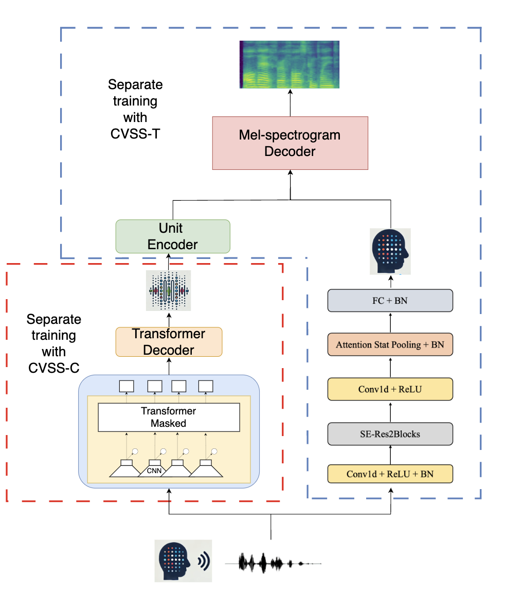
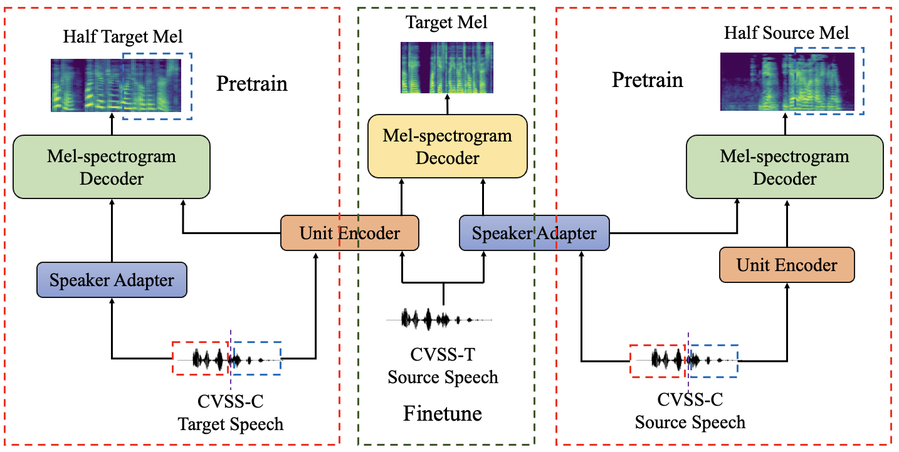

# SC-S2UT: Speaker Consistent Speech-to-Speech Translation

This repository contains the implementation of our Speaker Consistent Speech-to-Speech Translation (SC-S2UT) system, including the original SC-S2UT model, as well as the pretraining and embedding methods.

## Publications
- **Original SC-S2UT**: Published at APSIPA ASC 2024. Paper title: *Improving Speaker Consistency in Speech-to-Speech Translation Using Speaker Retention Unit-to-Mel Techniques*. [Read the Paper]([https://example.com](http://www.apsipa2024.org/files/papers/97.pdf))
- **Pretraining and Embedding Methods**: Available as an [arXiv preprint]([https://arxiv.org](http://www.apsipa2024.org/files/papers/97.pdf)) and being prepared for journal submission.

## System Overview
- The image below illustrates the SC-S2UT workflow.

- The image below introduces the pretrain-SC-S2UT approach.

## Usage Instructions

### Step 1: Access the Training Folder
First, navigate to the `train` directory. The `S2UT` and `SR-UTM` components are trained separately.

### Step 2: Train the S2UT Model
1. Navigate to the `s2ut` folder to train a **pretrained wav2vec2 encoder-based S2UT model**.
2. Download the **[CVSS-C corpus](https://github.com/google-research-datasets/cvss)**, which contains:
   - English data in a female voice.
   - Corresponding data in other languages from **[Common Voice version 4](https://commonvoice.mozilla.org/en/datasets)**.
3. We use the **es-en** (Spanish-English) language pair for training.

### Step 3: Train the SR-UTM Adapter
1. Prepare the **[CVSS-T corpus](https://github.com/google-research-datasets/cvss?tab=readme-ov-file)**.
2. Train the adapter using the provided training scripts.

### Step 4: Use the Self-Supervised Pretraining Method (Optional)
To use the self-supervised pretraining method:
- Train the **Speaker Adapter** using the **source speech** from CVSS-C.
- Train the **Unit-to-Mel structure** using the **target unit** data from CVSS-C.
- Finetune the **SR-UTM** using the CVSS-T
